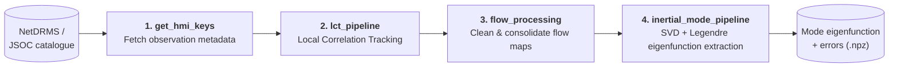

# Local Correlation Tracking — SDO/HMI Solar Flow Analysis

A four-stage Python pipeline that goes from raw SDO/HMI observation
metadata all the way to the extracted horizontal-velocity
eigenfunctions of solar inertial modes. Developed as part of doctoral
research at the Max Planck Institute for Solar System Research,
Göttingen.


[](https://codecov.io/gh/neelanchaljoshi/local_correlation_tracking)

## Contents

- [What this repository does](#what-this-repository-does)
- [The pipeline, end to end](#the-pipeline-end-to-end)
- [Quickstart: running it from scratch](#quickstart-running-it-from-scratch)
- [Repository layout](#repository-layout)
- [Dependencies](#dependencies)
- [Testing](#testing)
- [Related publications](#related-publications)
- [Author](#author)

---

## What this repository does

Local Correlation Tracking (LCT) measures horizontal plasma flows on
the Sun's surface by cross-correlating pairs of SDO/HMI images a short
time apart. Applied over years of data and projected onto spherical
harmonics, the resulting flow maps reveal **inertial modes** — large-
scale oscillatory flows predicted by solar rotating-fluid theory. This
repository implements the complete chain from raw observation metadata
to a cleaned, error-quantified eigenfunction for one specific mode,
processing on the order of 1 TB/year of image data to extract signals
at the limits of instrument sensitivity.

## The pipeline, end to end

Four stages, each its own folder with its own detailed `.md` reference:



| Stage | Folder | Reads | Writes | Automation |
|---|---|---|---|---|
| 1. Fetch metadata | [`get_hmi_keys/`](GET_HMI_KEYS.md) | NetDRMS catalogue (`show_info`) | `keys-<year>.fits` | Edit-the-source script — no CLI args, no config file |
| 2. Track flows | [`lct_pipeline/`](LCT_PIPELINE.md) | `keys-<year>.fits` + HMI FITS images | Per-month or per-chunk HDF5 flow maps | `.ini` config, CLI, SLURM (MPI and non-MPI modes), tested, in CI |
| 3. Clean & consolidate | [`flow_processing/`](FLOW_PROCESSING.md) | HDF5 flow maps | `processed_data/{uphi,utheta}_*_processed.npy` | Script with 2 positional CLI args, hand-edit for dataset selection |
| 4. Extract eigenfunctions | [`inertial_mode_pipeline/`](INERTIAL_MODE_PIPELINE.md) | `processed_data/*.npy` | `eigenfunction_clean_*.npz` | CLI + diagnostic tool, tested, in CI |

Each folder's linked `.md` is the exhaustive reference for that
stage — every function, every config key, every known rough edge.
This README only covers what you need to get the whole chain running.

## Quickstart: running it from scratch

### 1. Fetch HMI observation metadata

```bash
cd get_hmi_keys
# Edit config.py (cadence, series, output dir) and main.py (year range) first —
# there's no CLI for this stage.
python main.py
```
Produces one `keys-<year>.fits` per year, containing pointing,
quality, and storage-path metadata for every observation. Full
reference: **[GET_HMI_KEYS.md](GET_HMI_KEYS.md)**.

### 2. Run Local Correlation Tracking

```bash
# MPI mode: one SLURM array task per month, ranks split the spatial grid
sbatch --array=1-12 lct_pipeline/run_slurm.sh lct_pipeline/config/granulation.ini 2019

# Or the non-MPI, embarrassingly-parallel mode: one array task per time chunk
python lct_pipeline/main_chunk.py lct_pipeline/config/granulation.ini 2019 6 --print-nchunks
sbatch --array=1-30 lct_pipeline/run_slurm_chunk.sh lct_pipeline/config/granulation.ini 2019 6
```
Produces one HDF5 flow map per month (MPI mode) or per chunk (non-MPI
mode), each with `uphi`/`utheta` velocity arrays. Full reference,
including the non-MPI pipeline's range mode for targeting an arbitrary
window without day-offset arithmetic: **[LCT_PIPELINE.md](LCT_PIPELINE.md)**.

### 3. Clean and consolidate the flow maps

```bash
cd flow_processing
# Check that flow_data.py::getdata's active filename template and
# utils/io_utils.py's output suffix both match the dataset you're
# about to process — see FLOW_PROCESSING.md for why this matters.
python main.py uphi   hmi.ic_45s
python main.py utheta hmi.ic_45s
```
Concatenates 2010–2024, removes the static median flow, rejects
outliers, fits out an annual/semi-annual systematic, and writes one
`.npy` per flow component. Full reference: **[FLOW_PROCESSING.md](FLOW_PROCESSING.md)**.

### 4. Extract an inertial-mode eigenfunction

```bash
# Optional: check a span/df combination won't silently return an all-zero result
python inertial_mode_pipeline/check_span.py -171.0 hmi.ic_45s_granule --span_lower 2010 --span_upper 2025

python inertial_mode_pipeline/run_pipeline.py 2 -171.0 highlat hmi.ic_45s_granule sym \
    --l_max 22 --l_cutoff 15 --mc_samples 500
```
Fourier-transforms, bandpass-filters, extracts the mode via SVD,
projects onto Legendre polynomials with chi-squared noise filtering,
and estimates errors — one `.npz` per `(m, frequency, mode label,
symmetry, dataset)` combination. `data` picks which upstream LCT
run/cadence to use (e.g. `hmi.ic_45s_granule`, `hmi.m_45s`,
`hmi.m_720s_dt_1h`) and `mode` is a free-text label such as `rossby`,
`highlat`, `critlat`, `hfr` — see
**[INERTIAL_MODE_PIPELINE.md](INERTIAL_MODE_PIPELINE.md)** for the full
parameter reference.

## Repository layout

```
local_correlation_tracking/
├── get_hmi_keys/            Stage 1 — see GET_HMI_KEYS.md
├── lct_pipeline/            Stage 2 — see LCT_PIPELINE.md
├── flow_processing/         Stage 3 — see FLOW_PROCESSING.md
├── inertial_mode_pipeline/  Stage 4 — see INERTIAL_MODE_PIPELINE.md
├── data/                    Shared data root (metadata, processed flows, eigenfunctions)
├── plotting_scripts/        Publication-figure and analysis notebooks/scripts
├── pmi/                     ESA Vigil/PMI synthetic-parameter analysis
└── docs/                    Legacy Sphinx documentation (superseded by the .md files above)
```

## Dependencies

- Python 3.9+
- NumPy, SciPy, Pandas, Astropy, h5py, tqdm
- MPI4py (`lct_pipeline`'s MPI mode only — its non-MPI chunk mode needs no MPI)
- SLURM (for HPC cluster execution of stage 2 — the only stage with SLURM scripts)
- A local NetDRMS installation with `show_info` on `PATH` (stage 1 only)
- `zclpy3` — an MPS-internal package (stages 2 and 4's disk-geometry/remapping code), not on PyPI

## Testing

```bash
cd lct_pipeline && python -m pytest tests/ -v
cd inertial_mode_pipeline && python -m pytest tests/ -v
```
Both suites run in CI on every push (badge above) and mock the
`zclpy3`/`mpi4py` dependencies so they run without a real MPI
installation or the MPS-internal package. `get_hmi_keys/` and
`flow_processing/` currently have no tests in CI — see their `.md`
files for details.

## Related Publications

- Joshi, N., Liang, Z.-C., Fournier, D., et al., "Horizontal velocity
  eigenfunctions of solar inertial modes using local correlation tracking
  of magnetic features", *Astronomy & Astrophysics* (under review), 2026.
- Joshi, N., Liang, Z.-C., & Gizon, L., "A synthetic parameter analysis
  of correlation tracking of granulation and magnetic features for the PMI
  instrument", *Astronomy & Astrophysics* (in prep.), 2026.

## Author

**Neelanchal Joshi**

Doctoral Researcher, Max Planck Institute for Solar System Research

[neelanchaljoshi.github.io](https://neelanchaljoshi.github.io)
